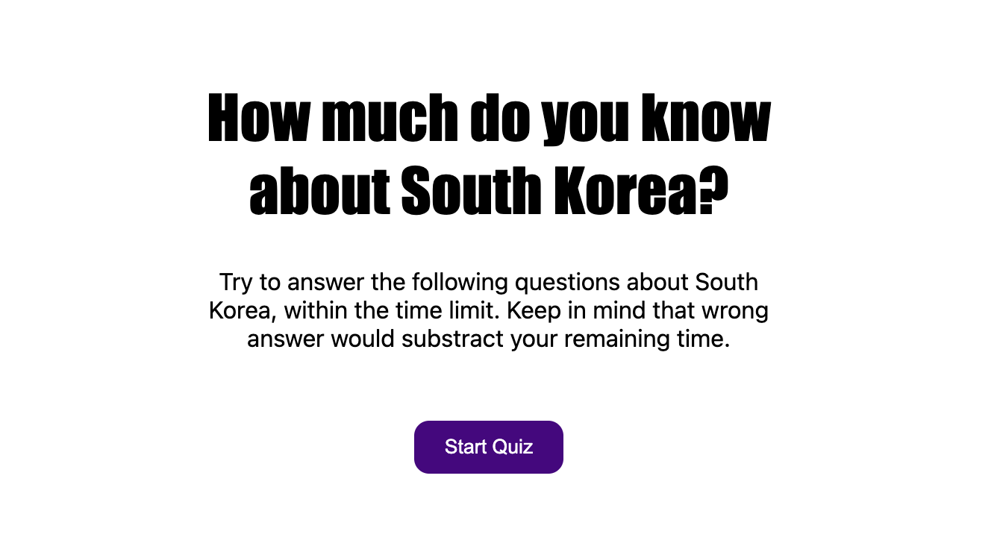

# can_u_answer_this

## Description
In this project, I made a quiz about South Korea by using JavaScript.
Start code was not provided and I started from scratch.
I made three questions, and set a time limit 100 seconds.
If wrong answer is clicked, remain time will be decreased by 10 seconds.

## Screenshot

## Deployed application link
https://d0kd0.github.io/hello_from_Korea